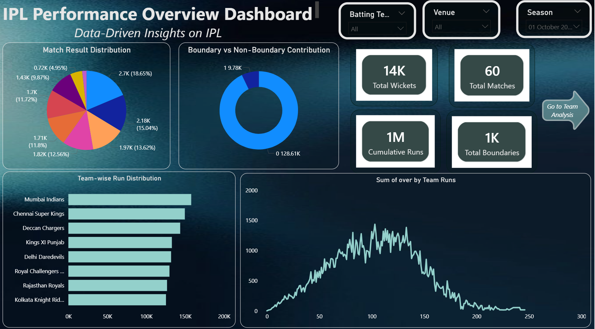
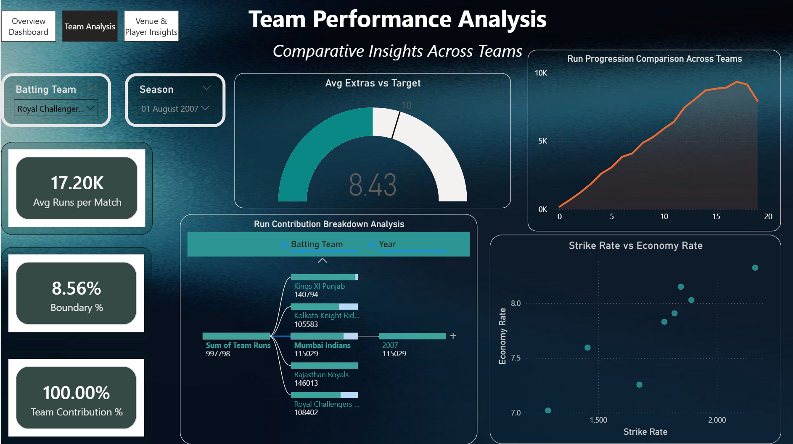
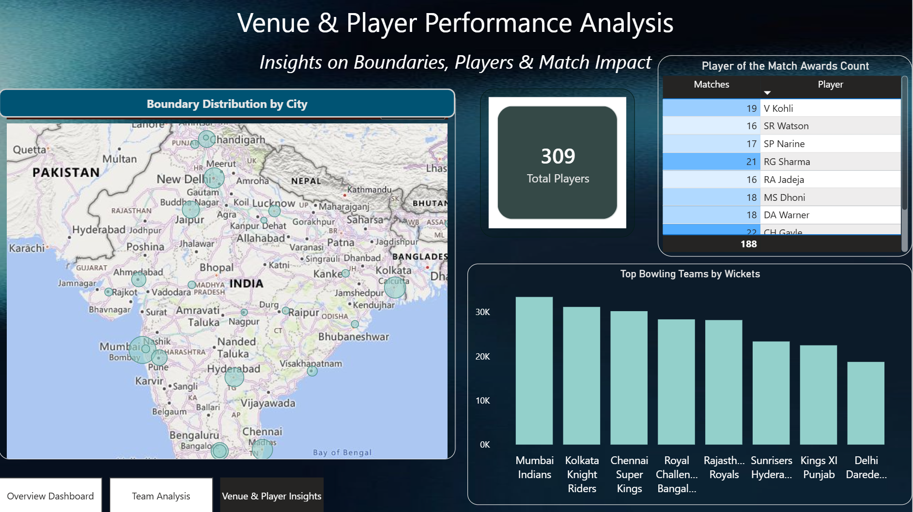
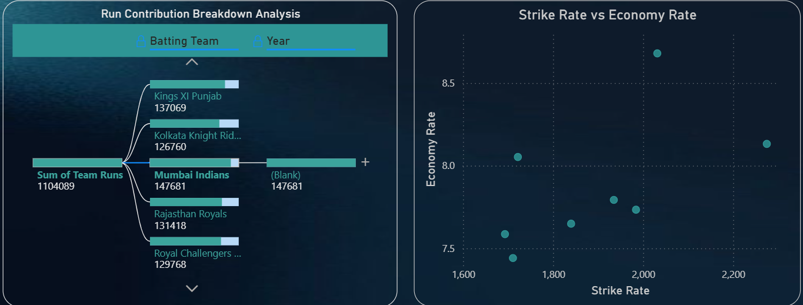

# IPL Performance Analysis Dashboard

An interactive Power BI dashboard developed to analyze IPL performance and transform ball-by-ball cricket data into meaningful, data-driven insights across teams, players, venues, batting, bowling, and match performance.

---

## Project Overview

The **IPL Performance Analysis Dashboard** is a data analysis and visualization project built using **Microsoft Power BI**.

The project focuses on exploring IPL match data across multiple seasons from **2008 to 2023** and presenting meaningful insights through interactive dashboards, KPIs, charts, maps, and comparative analysis.

The dashboard enables users to explore:

- Team performance
- Player performance
- Batting and scoring patterns
- Bowling and wicket performance
- Boundary distribution
- Venue and city-based performance
- Match-level trends
- Strike rate and economy rate
- Run contribution and progression

The project demonstrates the use of **Power Query for data preprocessing and transformation** and **DAX for analytical calculations and performance metrics**.

---

## Objectives

The main objectives of this project are:

- Analyze IPL performance across multiple seasons.
- Compare team-wise performance and scoring trends.
- Analyze individual player contributions.
- Study batting and bowling performance.
- Examine run progression and boundary distribution.
- Analyze venue and city-based performance.
- Calculate important performance metrics using DAX.
- Build an interactive dashboard for data-driven exploration.
- Convert granular ball-by-ball data into meaningful visual insights.

---

## Dataset

The project uses IPL **ball-by-ball match data covering multiple seasons from 2008 to 2023**.

The dataset contains detailed information related to:

- Match identification
- Batting team
- Bowling team
- Players
- Player of the Match
- Runs scored
- Wickets
- Overs
- Venue
- City
- Match-level information
- Boundary-related information

The granular nature of the dataset required preprocessing and aggregation before creating the dashboard.

---

## Data Preprocessing

The data was prepared using **Power Query** before being used for visualization and analysis.

Key preprocessing activities included:

- Data cleaning
- Data transformation
- Handling granular ball-by-ball records
- Creating calculated fields
- Preparing data for aggregation
- Applying transformations required for analysis
- Validating transformed data
- Preparing measures for dashboard-level analysis

Power BI and DAX were then used to calculate analytical metrics such as:

- Total Runs
- Total Wickets
- Average Runs
- Strike Rate
- Economy Rate
- Boundary-related metrics
- Team contribution
- Player performance metrics

---

## Tools & Technologies

| Category | Technologies |
|---|---|
| Data Visualization | Power BI |
| Data Transformation | Power Query |
| Analytical Calculations | DAX |
| Data Analysis | Microsoft Power BI |
| Data Source | IPL Ball-by-Ball Dataset |
| Documentation | Microsoft Word / PDF |

---

## Dashboard Sections

### 1. IPL Performance Overview

The overview dashboard provides a high-level summary of IPL performance using KPIs and visualizations.

It includes:

- Match Result Distribution
- Boundary vs Non-Boundary Contribution
- Total Wickets
- Total Matches
- Cumulative Runs
- Total Boundaries
- Team-wise Run Distribution
- Run Progression Analysis
- Interactive filters for batting team, venue, and season



---

### 2. Team Performance Analysis

The Team Performance Analysis section focuses on comparative team-level performance.

It includes:

- Average Runs per Match
- Boundary Percentage
- Team Contribution
- Average Extras vs Target
- Run Progression Comparison
- Run Contribution Breakdown
- Strike Rate vs Economy Rate
- Season-based filtering
- Batting team filtering



---

### 3. Venue & Player Performance Analysis

This section combines venue-based and player-level insights.

It includes:

- Boundary Distribution by City
- Player of the Match analysis
- Total Players
- Top Bowling Teams by Wickets
- Venue-based performance exploration
- Player contribution analysis
- Geographic visualization of IPL performance



---

### 4. Detailed Analytical Views

The dashboard also provides detailed analytical views for exploring relationships between different performance metrics.

Examples include:

- Run Contribution Breakdown
- Team-wise run contribution
- Year-wise analysis
- Strike Rate vs Economy Rate
- Comparative player/team performance



---

## Key Dashboard Features

- Interactive Power BI dashboard
- Interactive slicers and filters
- KPI cards
- Team-wise performance analysis
- Player performance analysis
- Venue and city-based analysis
- Run progression analysis
- Boundary analysis
- Bowling and wicket analysis
- Match result analysis
- Strike Rate vs Economy Rate comparison
- DAX-based analytical measures
- Power Query-based data preprocessing
- Geographic visualization
- Comparative team analysis

---

## Analytical Insights

The dashboard enables exploration of several important IPL performance patterns, including:

### Team Performance

Comparison of team-wise scoring and contribution across different seasons.

### Player Performance

Analysis of player contributions and Player of the Match awards.

### Batting Performance

Analysis of runs, boundaries, run contribution, and scoring progression.

### Bowling Performance

Analysis of wickets and team-level bowling performance.

### Venue Performance

Geographic exploration of boundaries and performance across different IPL cities and venues.

### Performance Metrics

Comparison of metrics such as:

- Strike Rate
- Economy Rate
- Average Runs
- Total Runs
- Total Wickets
- Boundary Percentage

---

## Data Visualization Techniques

The dashboard uses multiple visualization techniques to communicate insights effectively, including:

- KPI Cards
- Donut Charts
- Bar Charts
- Area Charts
- Scatter Plots
- Decomposition Trees
- Tables
- Maps
- Interactive Slicers
- Comparative Charts

These visualizations help users move from high-level KPIs to detailed performance analysis.

---

## Project Workflow

```text
IPL Ball-by-Ball Dataset
          ↓
Data Cleaning & Transformation
          ↓
Power Query
          ↓
Data Preparation
          ↓
DAX Measures & Calculations
          ↓
Data Modeling & Aggregation
          ↓
Power BI Visualizations
          ↓
Interactive Dashboard
          ↓
Performance Analysis & Insights
